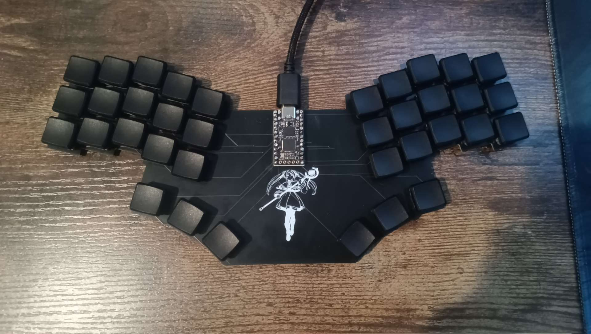

# Hollow Wood

A 36-key unified ergonomic keyboard designed from scratch in KiCad.





## Overview

Hollow Wood is a 36-key column-staggered ergonomic keyboard built as a single unified PCB.

## Specs

| Property | Details |
|---|---|
| Keys | 36 |
| Matrix | 4 rows × 10 columns |
| Switches | Kailh Choc V1 (hotswap) |
| Controller | Sea-Picro RP2040 |
| Firmware | QMK |
| Layout | Colemak |
| PCB | 2-layer, black, JLCPCB |
| Case | Caseless |

## Layout

```
┌───┬───┬───┬───┬───┐              ┌───┬───┬───┬───┬───┐
│ Q │ W │ F │ P │ G │              │ J │ L │ U │ Y │ ; │
├───┼───┼───┼───┤───┤              ├───┼───┼───┼───┤───┤
│ A │ R │ S │ T │ D │              │ H │ N │ E │ I │ O │
├───┼───┼───┼───┤───┤              ├───┼───┼───┼───┤───┤
│ Z │ X │ C │ V │ B │              │ K │ M │ , │ . │ / │
└───┴───┼───┼───┤───┤              ├───┼───┼───┼───┴───┘
        │ESC│SPC│TAB│              │ENT│DEL│SFT│
        └───┴───┴───┘              └───┴───┴───┘
            NUM  NAV               SYM
```

## Layers

- **Base** — Colemak
- **NUM** — Numbers and symbols (hold Space)
- **SYM** — Symbols and brackets (hold Enter)
- **NAV** — Arrow keys and navigation (hold Tab)

## BOM

| Part | Qty |
|---|---|
| Kailh Choc V1 hotswap sockets | 36 |
| 1N4148 SOD-123 diodes | 36 |
| Sea-Picro RP2040 controller | 1 |
| Kailh Choc V1 switches | 36 |
| MBK keycaps | 36 |
| Rubber bumpons | ~8 |

## Files

- `/pcb` — KiCad PCB and schematic files
- `/firmware` — QMK Firmware Files
- `/gerber` — Production-ready gerber files

### PCB

Order gerbers from JLCPCB with the following settings:
- 2-layer board
- 1.6mm thickness
- Black PCB
- White silkscreen

### Keyboard Layout Editor

```
[{r:15,x:3,a:7},""],
[{y:-0.75,x:2},"",{x:1},""],
[{y:-0.75,x:1},"",{x:3},""],
[{y:-0.5,x:3},""],
[{y:-0.75,x:2},"",{x:1},""],
[{y:-0.75,x:1},"",{x:3},""],
[{y:-0.5,x:3},""],
[{y:-0.75,x:2},"",{x:1},""],
[{y:-0.75,x:1},"",{x:3},""],
[{rx:5,ry:5,y:0.25,x:-2},""],
[{r:30,y:-0.75,x:-0.5},""],
[{r:45,y:-1.25,x:1},""],
[{r:-45,rx:10,y:0.25,x:-2},""],
[{r:-30,y:-0.75,x:-0.5},""],
[{r:-15,y:-1.25,x:1},""],
[{rx:15,ry:0,x:-4},""],
[{y:-0.75,x:-5},"",{x:1},""],
[{y:-0.75,x:-6},"",{x:3},""],
[{y:-0.5,x:-4},""],
[{y:-0.75,x:-5},"",{x:1},""],
[{y:-0.75,x:-6},"",{x:3},""],
[{y:-0.5,x:-4},""],
[{y:-0.75,x:-5},"",{x:1},""],
[{y:-0.75,x:-6},"",{x:3},""]

```

## Author

mefred
